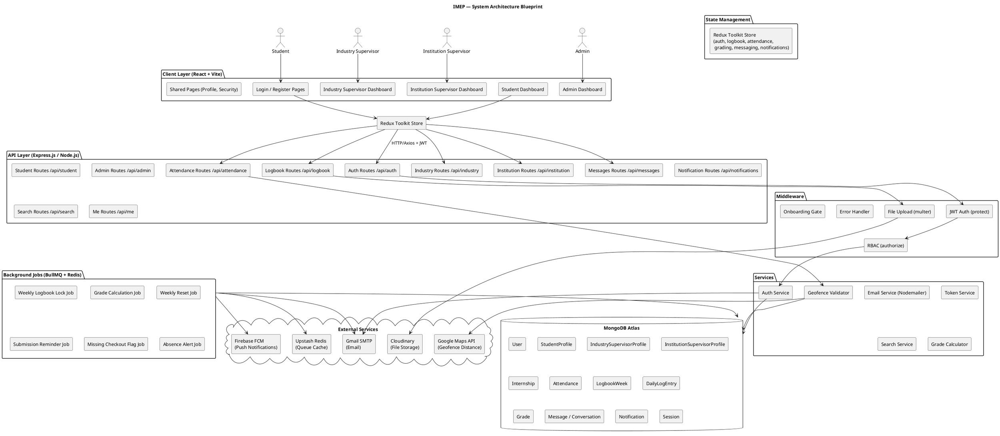
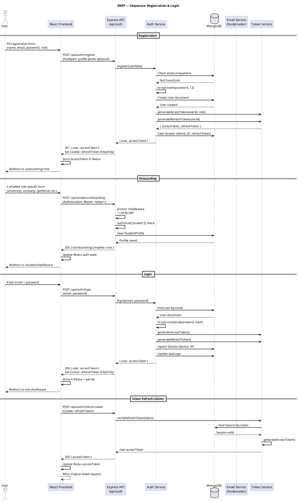
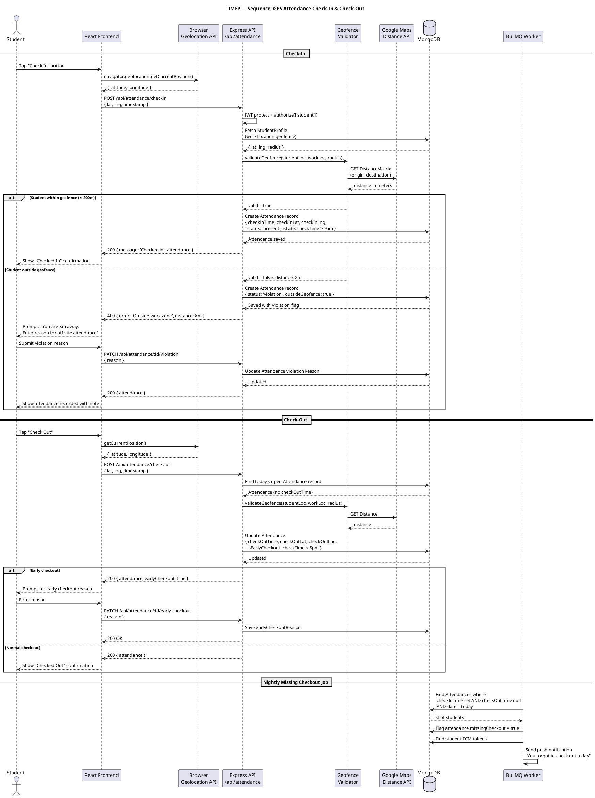
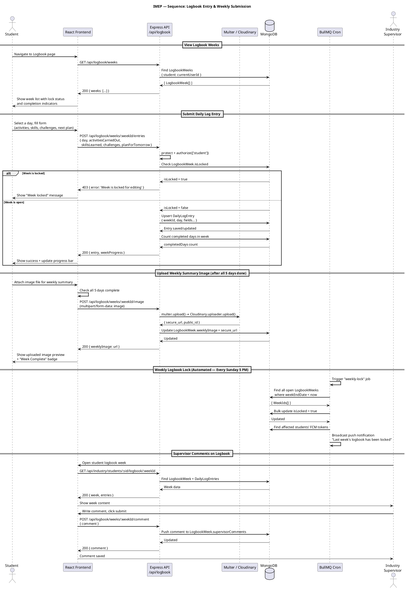
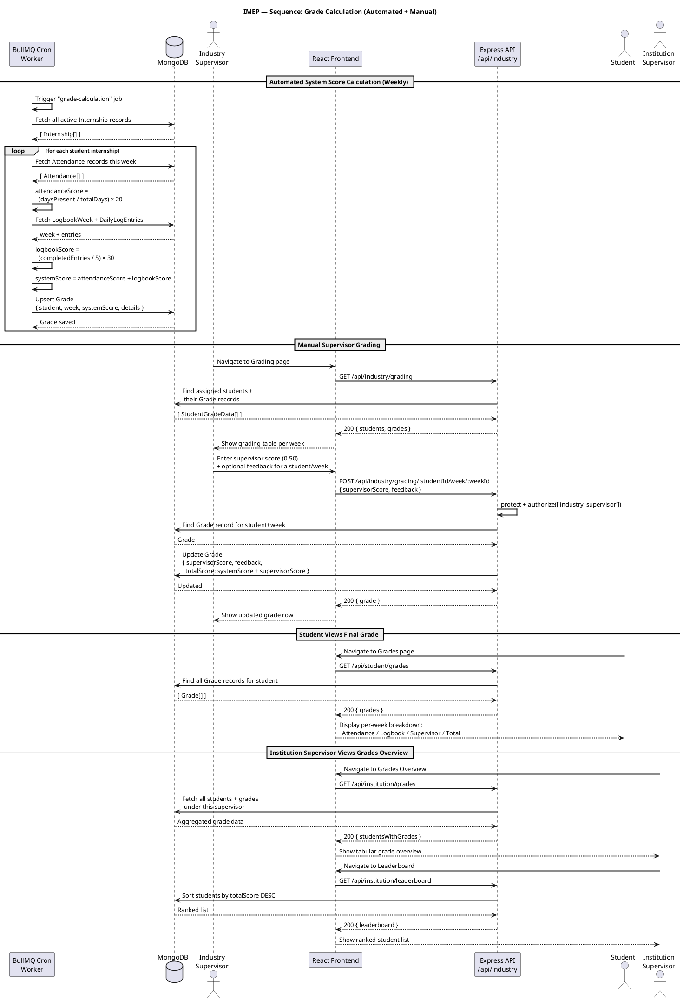
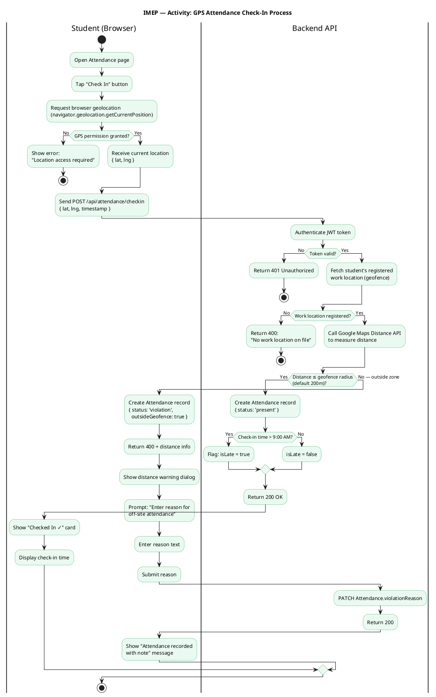
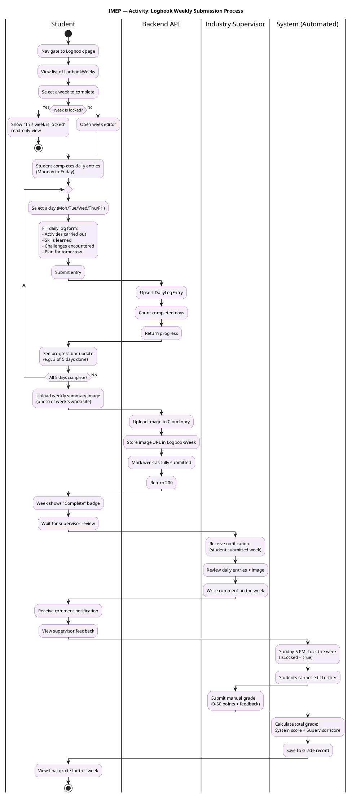
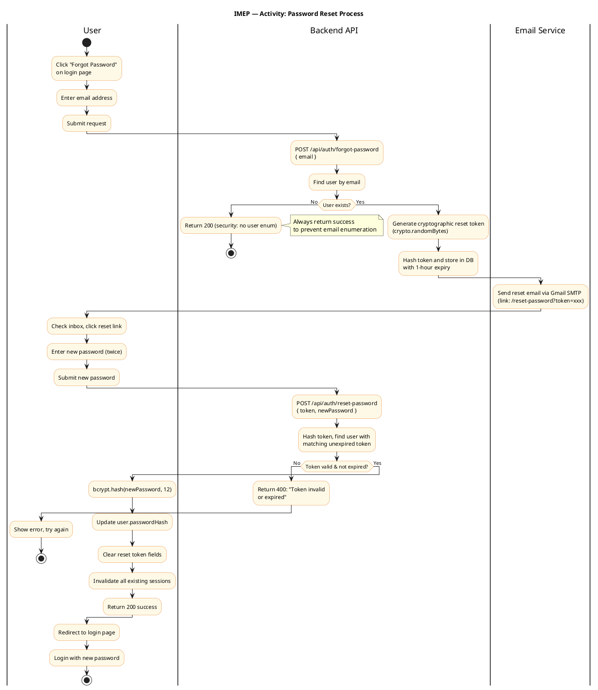

# IMEP — System Diagrams

**Internship Management & Evaluation Platform**
All diagrams are written in PlantUML. Paste any block at [https://www.plantuml.com/plantuml/uml/](https://www.plantuml.com/plantuml/uml/) to render.

---

## 1. Blueprint (System Architecture)



---

## 2. Use Case Diagram

```plantuml
@startuml IMEP_UseCaseDiagram

skinparam backgroundColor #FFFFFF
skinparam actorStyle awesome
skinparam defaultFontName Arial
left to right direction

title IMEP — Use Case Diagram

actor Student as S
actor "Industry Supervisor" as IS
actor "Institution Supervisor" as ISup
actor Admin as A
actor "System (Cron)" as SYS

rectangle "Authentication & Onboarding" {
  usecase "Register Account" as UC_REG
  usecase "Login" as UC_LOGIN
  usecase "Reset Password" as UC_RESET
  usecase "Complete Onboarding" as UC_ONBOARD
  usecase "Manage Sessions" as UC_SESSION
  usecase "Update Profile" as UC_PROFILE
}

rectangle "Student Features" {
  usecase "View Dashboard" as UC_STU_DASH
  usecase "Check-In (GPS)" as UC_CHECKIN
  usecase "Check-Out (GPS)" as UC_CHECKOUT
  usecase "Report Violation Reason" as UC_VIOL
  usecase "View Attendance History" as UC_ATT_HIST
  usecase "Create Daily Log Entry" as UC_LOG_ENTRY
  usecase "Upload Weekly Summary Image" as UC_LOG_IMG
  usecase "View Logbook Weeks" as UC_LOG_VIEW
  usecase "View Grades" as UC_GRADES
  usecase "Nominate Supervisor" as UC_NOMINATE
}

rectangle "Industry Supervisor Features" {
  usecase "View Assigned Students" as UC_IS_STUDENTS
  usecase "View Student Logbook" as UC_IS_LOGBOOK
  usecase "Submit Supervisor Grade" as UC_IS_GRADE
  usecase "Comment on Logbook Week" as UC_IS_COMMENT
  usecase "View Student Attendance" as UC_IS_ATT
}

rectangle "Institution Supervisor Features" {
  usecase "View All Students" as UC_ISP_STUDENTS
  usecase "Assign Internship" as UC_ISP_ASSIGN
  usecase "View Grades Overview" as UC_ISP_GRADES
  usecase "View Leaderboard" as UC_ISP_LEAD
  usecase "Search Students & Supervisors" as UC_SEARCH
}

rectangle "Messaging" {
  usecase "Send Message" as UC_MSG_SEND
  usecase "View Conversations" as UC_MSG_VIEW
}

rectangle "Notifications" {
  usecase "Receive Push Notification" as UC_PUSH
  usecase "View Notification History" as UC_NOTIF_VIEW
  usecase "Register FCM Token" as UC_FCM
}

rectangle "Admin Features" {
  usecase "View System Statistics" as UC_ADM_STATS
  usecase "Manage Users" as UC_ADM_USERS
  usecase "Deactivate / Activate User" as UC_ADM_TOGGLE
  usecase "Edit Attendance Records" as UC_ADM_ATT
  usecase "Sync Logbook Weeks" as UC_ADM_SYNC
  usecase "Submit Grade (On Behalf)" as UC_ADM_GRADE
}

rectangle "Automated System Jobs" {
  usecase "Lock Logbook Week (Weekly)" as UC_SYS_LOCK
  usecase "Calculate Grades (Weekly)" as UC_SYS_GRADE
  usecase "Send Submission Reminder" as UC_SYS_REM
  usecase "Flag Missing Checkout" as UC_SYS_CHECKOUT
  usecase "Alert Absence" as UC_SYS_ABS
}

' Student associations
S --> UC_REG
S --> UC_LOGIN
S --> UC_RESET
S --> UC_ONBOARD
S --> UC_SESSION
S --> UC_PROFILE
S --> UC_STU_DASH
S --> UC_CHECKIN
S --> UC_CHECKOUT
S --> UC_VIOL
S --> UC_ATT_HIST
S --> UC_LOG_ENTRY
S --> UC_LOG_IMG
S --> UC_LOG_VIEW
S --> UC_GRADES
S --> UC_NOMINATE
S --> UC_MSG_SEND
S --> UC_MSG_VIEW
S --> UC_PUSH
S --> UC_NOTIF_VIEW
S --> UC_FCM

' Industry Supervisor associations
IS --> UC_LOGIN
IS --> UC_PROFILE
IS --> UC_IS_STUDENTS
IS --> UC_IS_LOGBOOK
IS --> UC_IS_GRADE
IS --> UC_IS_COMMENT
IS --> UC_IS_ATT
IS --> UC_MSG_SEND
IS --> UC_MSG_VIEW
IS --> UC_PUSH

' Institution Supervisor associations
ISup --> UC_LOGIN
ISup --> UC_PROFILE
ISup --> UC_ISP_STUDENTS
ISup --> UC_ISP_ASSIGN
ISup --> UC_ISP_GRADES
ISup --> UC_ISP_LEAD
ISup --> UC_SEARCH
ISup --> UC_MSG_SEND
ISup --> UC_MSG_VIEW
ISup --> UC_PUSH

' Admin associations
A --> UC_LOGIN
A --> UC_ADM_STATS
A --> UC_ADM_USERS
A --> UC_ADM_TOGGLE
A --> UC_ADM_ATT
A --> UC_ADM_SYNC
A --> UC_ADM_GRADE
A --> UC_IS_LOGBOOK

' System Cron associations
SYS --> UC_SYS_LOCK
SYS --> UC_SYS_GRADE
SYS --> UC_SYS_REM
SYS --> UC_SYS_CHECKOUT
SYS --> UC_SYS_ABS

' Include relationships
UC_CHECKIN ..> UC_VIOL : <<include>>\n(if violation)
UC_CHECKOUT ..> UC_VIOL : <<include>>\n(if early)
UC_LOG_ENTRY ..> UC_LOG_IMG : <<extend>>\n(after 5 days)
UC_SYS_REM ..> UC_PUSH : <<include>>
UC_SYS_ABS ..> UC_PUSH : <<include>>
UC_SYS_CHECKOUT ..> UC_PUSH : <<include>>

@enduml
```



---

## 3. Sequence Diagrams

### 3a. User Registration & Login Flow



---

### 3b. GPS Attendance Check-In Flow



---

### 3c. Logbook Entry & Weekly Submission



---

### 3d. Grading Flow (Automated + Manual)



---

## 4. Activity Diagrams

### 4a. Student Internship Lifecycle

```plantuml
@startuml IMEP_Activity_Lifecycle

skinparam backgroundColor #FFFFFF
skinparam defaultFontName Arial
skinparam ActivityBorderColor #4A90D9
skinparam ActivityBackgroundColor #EBF5FB

title IMEP — Activity: Student Internship Lifecycle

|Student|
start

:Register Account\n(name, email, password, role=student);

:Verify Email (optional)\nand Login;

:Complete Onboarding\n(university, department, level,\ncompany, internship dates,\nwork location geofence);

:Student Dashboard activated;

fork
  |Student|
  :Daily Activities\n(Attendance + Logbook);

  repeat
    :Check-In at work site\n(GPS validation);
    if (Within geofence?) then (Yes)
      :Record check-in → Present;
    else (No)
      :Prompt violation reason;
      :Record check-in → Violation;
    endif

    :Perform daily work activities;

    :Write Daily Log Entry\n(activities, skills,\nchallenges, next plan);

    :Check-Out at end of day;
    if (Early checkout?) then (Yes)
      :Enter early checkout reason;
    endif

  repeat while (End of work week?) is (No)

  :Upload Weekly Summary Image;

  |System|
  :Sunday 5 PM:\nAuto-lock LogbookWeek;

  |Student|
  :Cannot edit past weeks;

fork again
  |Industry Supervisor|
  :View student logbook\nweekly entries;
  :Add comments/feedback;
  :Submit supervisor grade\n(0–50 points);

fork again
  |System|
  :Weekly:\nCalculate system score\n(Attendance 0–20 +\nLogbook 0–30 = 0–50);
  :Combine with supervisor score\n→ Total (0–100);
  :Update Grade record;

  :Daily:\nCheck missing checkouts;
  :Send reminder notifications;
end fork

|Student|
:View weekly grades\nand feedback;

if (Internship period complete?) then (No)
  :Continue next week;
  backward: Next Week;
else (Yes)
  :Internship ends;
endif

|Institution Supervisor|
:View final grades overview;
:View Leaderboard;
:Generate internship report;

|Student|
stop

@enduml
```

---

### 4b. GPS Attendance Check-In Process



---

### 4c. Logbook Weekly Submission Process



---

### 4d. Password Reset Process



---

## Diagram Rendering Instructions

All diagrams above use **PlantUML** syntax. To render them:

1. **Online (fastest):** Go to [plantuml.com](https://www.plantuml.com/plantuml/uml/) and paste any `@startuml...@enduml` block
2. **VS Code:** Install the **PlantUML** extension by `jebbs`, then open a `.puml` file and press `Alt+D` to preview
3. **Export:** The PlantUML online editor lets you download PNG, SVG, or PDF
4. **IntelliJ / WebStorm:** Install the PlantUML Integration plugin

### Save as `.puml` files
Each diagram block can be saved individually as:
- `architecture.puml`
- `use-case.puml`
- `seq-auth.puml`
- `seq-attendance.puml`
- `seq-logbook.puml`
- `seq-grading.puml`
- `activity-lifecycle.puml`
- `activity-checkin.puml`
- `activity-logbook.puml`
- `activity-password-reset.puml`
