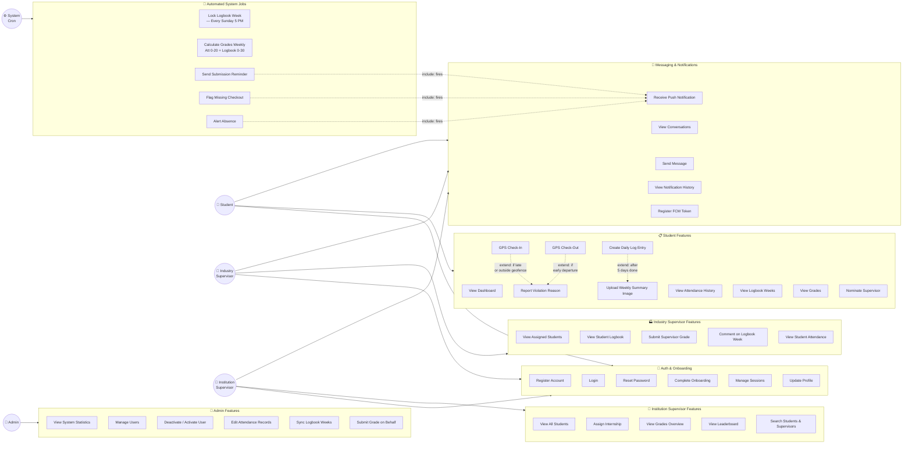
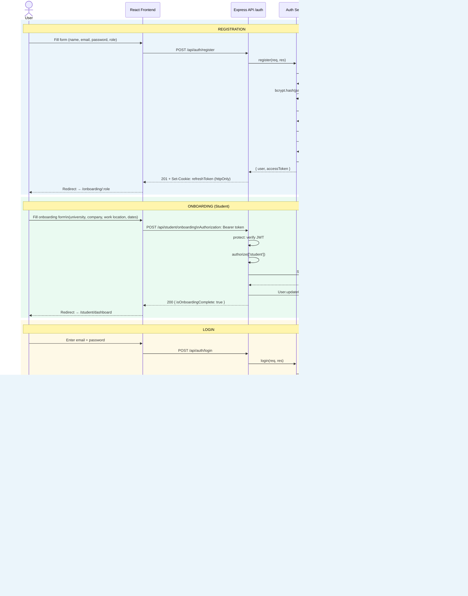
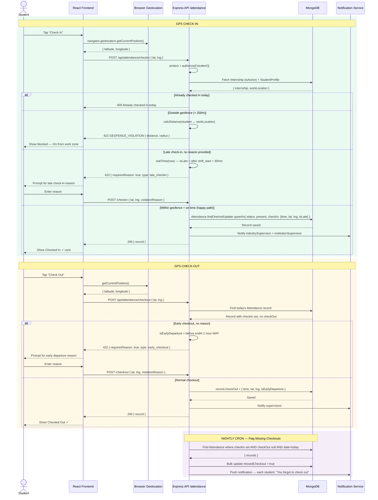
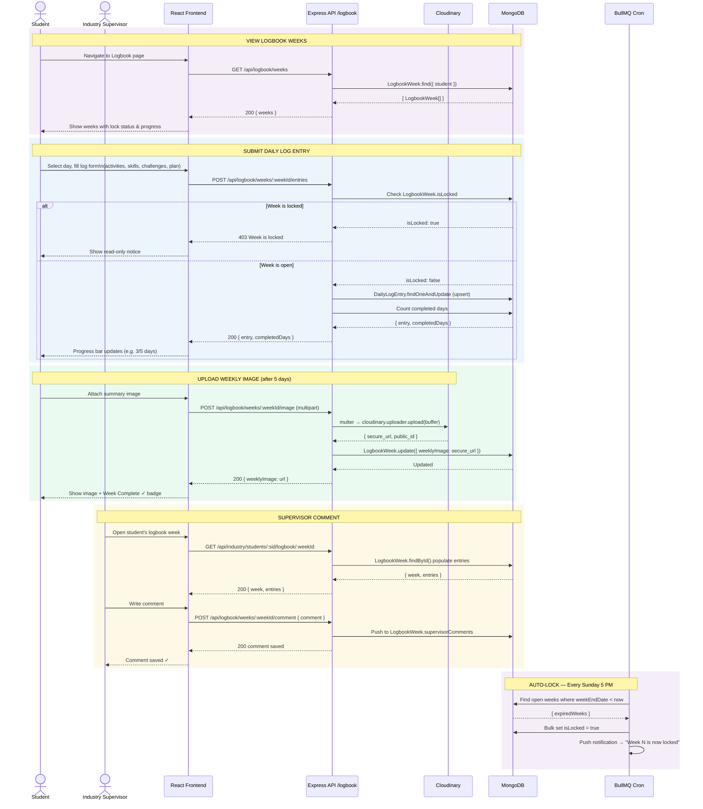
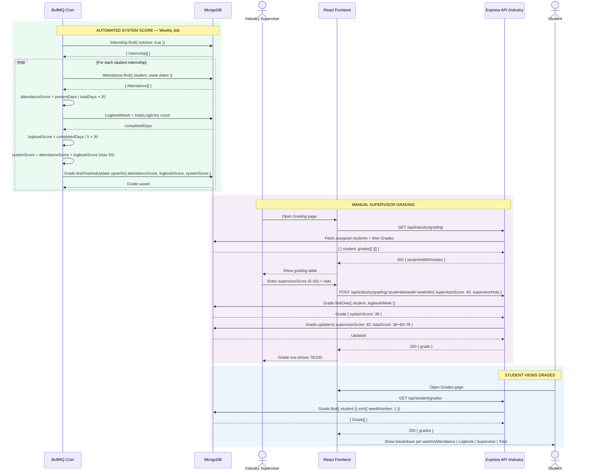
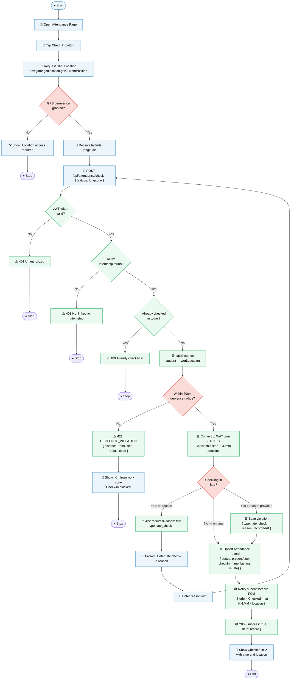
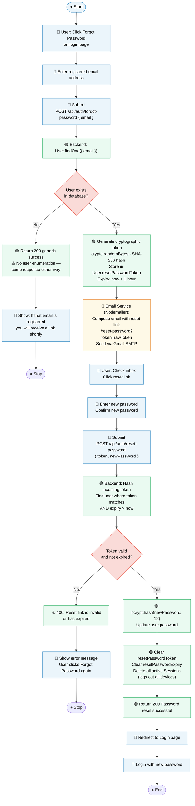

# IMEP — UML Diagrams (Mermaid)

> **To preview:** Open this file in VS Code → press `Ctrl + Shift + V`
> No extensions or Java needed — VS Code renders Mermaid natively.

---

## 1. Use Case Diagram

---

## 2a. Sequence Diagram — Registration, Onboarding & Login

---

## 2b. Sequence Diagram — GPS Attendance Check-In & Check-Out

---

## 2c. Sequence Diagram — Logbook Entry & Weekly Submission

---

## 2d. Sequence Diagram — Grade Calculation

---

## 3a. Activity Diagram — Student Internship Lifecycle

```mermaid
flowchart TD
    classDef student fill:#EBF5FB,stroke:#2E86C1,color:#000
    classDef instSup fill:#EAFAF1,stroke:#27AE60,color:#000
    classDef indSup  fill:#F5EEF8,stroke:#8E44AD,color:#000
    classDef system  fill:#FEF9E7,stroke:#E67E22,color:#000
    classDef decision fill:#FADBD8,stroke:#E74C3C,color:#000

    START([● Start]):::student --> REG

    REG["👤 Student: Register Account\nfirstName · lastName · email · password · role"]:::student
    REG --> LOGIN["👤 Student: Login"]:::student
    LOGIN --> ONBOARD["👤 Student: Complete Onboarding\nuniversity · company · work location · dates"]:::student
    ONBOARD --> ASSIGN["🏫 Institution Supervisor:\nAssign Internship to Student"]:::instSup
    ASSIGN --> DASH["👤 Student Dashboard Activated"]:::student

    DASH --> WEEK_LOOP

    subgraph WEEK_LOOP["── Weekly Loop ──────────────────────────────────────────"]
        direction TD
        CHECKIN["👤 GPS Check-In"]:::student --> GEO_OK{Within 200m\ngeofence?}:::decision
        GEO_OK -->|No - Blocked| BLOCKED["❌ Check-in blocked\nShow distance error"]:::student
        GEO_OK -->|Yes| LATE{Arriving late?\nafter shift_start + 30m}:::decision
        LATE -->|Yes| LATE_REASON["👤 Enter late reason\nViolation recorded"]:::student
        LATE -->|No| WORK
        LATE_REASON --> WORK

        WORK["👤 Daily work activities"]:::student
        WORK --> LOG["👤 Write Daily Log Entry\nactivities · skills · challenges · plan"]:::student
        LOG --> CHECKOUT["👤 GPS Check-Out"]:::student
        CHECKOUT --> EARLY{Early departure?\nbefore endH-1h:30m}:::decision
        EARLY -->|Yes| EARLY_REASON["👤 Enter early departure reason"]:::student
        EARLY -->|No| DAYS_DONE
        EARLY_REASON --> DAYS_DONE

        DAYS_DONE{5 days\ncomplete?}:::decision
        DAYS_DONE -->|No - Next day| CHECKIN
        DAYS_DONE -->|Yes| IMG["👤 Upload Weekly Summary Image\nStored on Cloudinary"]:::student

        IMG --> SYS_LOCK["⚙️ System (Sunday 5PM):\nAuto-lock LogbookWeek\nPush notif: Week Locked"]:::system
        SYS_LOCK --> IS_REVIEW["🏭 Industry Supervisor:\nReview weekly entries + image\nAdd comment / feedback"]:::indSup
        IS_REVIEW --> IS_GRADE["🏭 Industry Supervisor:\nSubmit grade 0–50 + note"]:::indSup
        IS_GRADE --> SYS_CALC["⚙️ System (Weekly Cron):\nattendanceScore = presentDays/total × 20\nlogbookScore = completedDays/5 × 30\ntotalScore = systemScore + supervisorScore"]:::system
        SYS_CALC --> GRADE_VIEW["👤 Student: View weekly grade breakdown\nAttendance | Logbook | Supervisor | Total"]:::student

        SYS_CALC --> MISS["⚙️ System (Nightly):\nFlag missedCheckout\nSend reminder notifications"]:::system
    end

    GRADE_VIEW --> DONE{Internship\nperiod over?}:::decision
    DONE -->|No| WEEK_LOOP
    DONE -->|Yes| END_STUDENT["👤 Internship Ends"]:::student

    END_STUDENT --> OVERVIEW["🏫 Institution Supervisor:\nView Final Grades Overview\nView Leaderboard"]:::instSup

    OVERVIEW --> STOP([● End]):::student
```

---

## 3b. Activity Diagram — GPS Check-In Process

---

## 3c. Activity Diagram — Logbook Submission Process

```mermaid
flowchart TD
    classDef student fill:#F5EEF8,stroke:#8E44AD,color:#000
    classDef backend fill:#EAFAF1,stroke:#27AE60,color:#000
    classDef cloud   fill:#EBF5FB,stroke:#2E86C1,color:#000
    classDef indSup  fill:#FEF9E7,stroke:#E67E22,color:#000
    classDef system  fill:#FADBD8,stroke:#E74C3C,color:#000
    classDef decision fill:#FADBD8,stroke:#E74C3C,color:#000

    START([● Start]):::student --> NAV["👤 Student: Navigate to Logbook page\nGET /api/logbook/weeks"]:::student
    NAV --> WEEKS["👤 View list of LogbookWeeks\nwith lock status & completion"]:::student
    WEEKS --> SELECT["👤 Select a week"]:::student
    SELECT --> LOCKED{Week\nlocked?}:::decision
    LOCKED -->|Yes| READ_ONLY["👤 Show read-only view\nWeek is locked for editing"]:::student
    READ_ONLY --> STOP1([● Stop])
    LOCKED -->|No| EDITOR["👤 Open week editor"]:::student

    EDITOR --> DAY_LOOP

    subgraph DAY_LOOP["── Repeat Mon – Fri ──────────────────────────────"]
        direction TD
        SEL_DAY["👤 Select a day\nMonday / Tuesday / Wednesday / Thursday / Friday"]:::student
        SEL_DAY --> FILL["👤 Fill Daily Log Entry form\n• Activities Carried Out\n• Skills Learned\n• Challenges Encountered\n• Plan for Tomorrow"]:::student
        FILL --> SUBMIT_ENTRY["👤 Submit entry\nPOST /api/logbook/weeks/:weekId/entries"]:::student
        SUBMIT_ENTRY --> API_ENTRY["🟢 Backend: Upsert DailyLogEntry\nCount completed days\nReturn { entry, completedDays }"]:::backend
        API_ENTRY --> PROGRESS["👤 Progress bar updates\ne.g. 3 of 5 days done"]:::student
        PROGRESS --> FIVE{All 5 days\ncomplete?}:::decision
        FIVE -->|No| SEL_DAY
    end

    FIVE -->|Yes| IMG_UP["👤 Upload Weekly Summary Image\nPOST /api/logbook/weeks/:weekId/image"]:::student
    IMG_UP --> CLOUD["☁️ Cloudinary: Upload image buffer\nReceive { secure_url }"]:::cloud
    CLOUD --> SAVE_IMG["🟢 Backend: Update LogbookWeek.weeklyImage\nReturn 200 { weeklyImage: url }"]:::backend
    SAVE_IMG --> COMPLETE["👤 Show Week Complete ✓ badge"]:::student

    COMPLETE --> IS_REVIEW["🏭 Industry Supervisor:\nReceive notification → review entries + image"]:::indSup
    IS_REVIEW --> IS_COMMENT["🏭 Industry Supervisor:\nWrite comment on the week"]:::indSup
    IS_COMMENT --> SAVE_CMT["🟢 Backend: Save to LogbookWeek.supervisorComments\nPush notification to student"]:::backend
    SAVE_CMT --> STU_NOTIF["👤 Student: Receive comment notification\nView supervisor feedback"]:::student

    STU_NOTIF --> SYS_LOCK["⚙️ System: Sunday 5 PM\nAuto-lock week (isLocked = true)\nPush: Your logbook for Week N is locked"]:::system
    SYS_LOCK --> IS_GRADE["🏭 Industry Supervisor:\nSubmit manual grade 0–50 + note"]:::indSup
    IS_GRADE --> SYS_GRADE["⚙️ System: Calculate total grade\ntotalScore = systemScore + supervisorScore"]:::system
    SYS_GRADE --> VIEW_GRADE["👤 Student: View final grade for this week"]:::student
    VIEW_GRADE --> STOP2([● End])
```

---

## 3d. Activity Diagram — Password Reset Process

